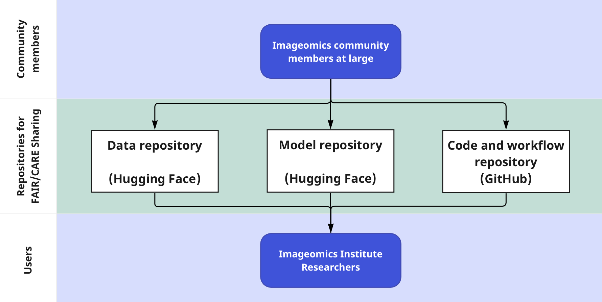

# Welcome to the Imageomics Institute Guide!

This website hosts guides to Imageomics workflows, documentation, and general best-practices for collaborative science. We aim to provide a helpful resource for a broad base of scientists working in the field of [_imageomics_](wiki-guide/Glossary-for-Imageomics.md/#imageomics) and beyond.

It houses the information needed to get started with and use institute resources readily available to all members. However, most of this guide is applicable to anyone working more broadly in the field of imageomics or adjacent fields of computer and data science, and it is tailored to help domain scientists bridging that gap.

## Highlights

There are many pages of useful information contained in this guide covering a range of topics from project management and workflows, to repositories and archives, to a glossary of _imageomics-related_ terms for improved interdisciplinary communication.

### Just starting a project?
Check out our guides to get your project off on the right foot!

- [The GitHub Repo Guide](wiki-guide/GitHub-Repo-Guide.md): This page reviews expected and suggested GitHub repository contents, as well as structural considerations. 

- [The Hugging Face Repo Guide](wiki-guide/Hugging-Face-Repo-Guide.md): Analogous expected and suggested repository contents for Hugging Face repositories; there are notable differences from GitHub in both content and structure.

- [Metadata Guide](wiki-guide/Metadata-Guide.md): Guide to metadata collection and documentation. This closely follows our [HF Dataset Card Template](wiki-guide/HF_DatasetCard_Template_mkdocs.md) sections.

### Project repo up, what's next?
Check out our workflow guides for how to interact with your new repo:

- [The GitHub Workflow](wiki-guide/The-GitHub-Workflow.md): This page mainly focuses on branching and the PR process.

- [The Hugging Face Workflow](wiki-guide/The-Hugging-Face-Workflow.md): Analogous workflow directions for Hugging Face; there are notable differences from GitHub in how this process works practically, though the concept is the same.

### Project management or organization got you down?
Discover new tools to help:

- [Guide to GitHub Projects](wiki-guide/Guide-to-GitHub-Projects.md): This page focuses on GitHub's project management tool, Projects, which integrates issues and pull requests into a unified task board to keep tabs on how your project is progressing. Labels, milestones, and assignee tags provide improved organization, and allow for more focused views.

- [Helpful Tools for your Workflow](wiki-guide/Helpful-Tools-for-your-Workflow.md): Collection of useful tools to facilitate and improve workflows. Comments and recommendations encouraged!

- [Virtual Environments](wiki-guide/Virtual-Environments.md): Summary of `conda` and `pip` environments: how to make, use, and share them.

## Collaborative Infrastructure We Use

- GitHub
    - [Institute Code Repositories](https://github.com/Imageomics) where we store our code (software + tools).
    - GitHub's [Docs](https://docs.github.com/en)
        - [Repositories](https://docs.github.com/en/repositories)
        - [GitHub Projects](https://docs.github.com/en/issues/planning-and-tracking-with-projects)
- Hugging Face
    - [Imageomics Organization page](https://huggingface.co/imageomics) where we store our datasets and models (and their metadata).
    - Additionally, use [Hugging Face Spaces](https://huggingface.co/docs/hub/spaces) to run demos of models and other projects.
    - Hugging Face's [Docs](https://huggingface.co/docs)
        - [Model Hub](https://huggingface.co/docs/hub/models-the-hub)
        - [Datasets](https://huggingface.co/docs/hub/datasets-overview)

### Collaborative Infrastructure Diagram

## Imageomics Branding (Logos)

We have two versions of the logo, a [fish](logos/Imageomics_logo_fish.png) and a [butterfly](logos/Imageomics_logo_butterfly.png), which should be used for scientific posters, conference, workshop, and meeting marketing materials, etc. Choice of logo is based on user preference.

{: style="width:45%"}
{: style="width:45%"}

## Other pages of note
- [Glossary for Imageomics](wiki-guide/Glossary-for-Imageomics.md): Collection of terms used in imageomics. The goal is to ensure all participating domains are represented, thus facilitating interdisciplinary communication. This is a group effort, please check it out and add terms you think should be there!
- [Command Line Cheat Sheet](wiki-guide/Command-Line-Cheat-Sheet.md): Collection of useful bash and git commands with some git tips.

 
 

!!! question "[Questions, Comments, or Concerns?](https://github.com/Imageomics/Imageomics-guide/issues)"
