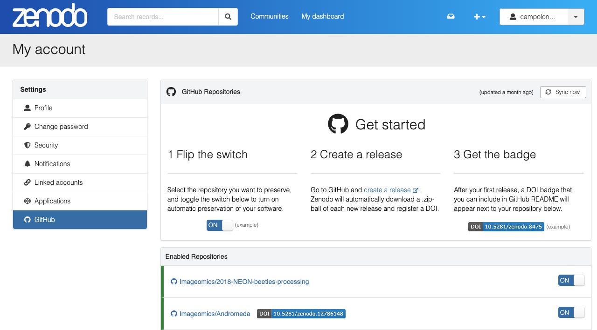
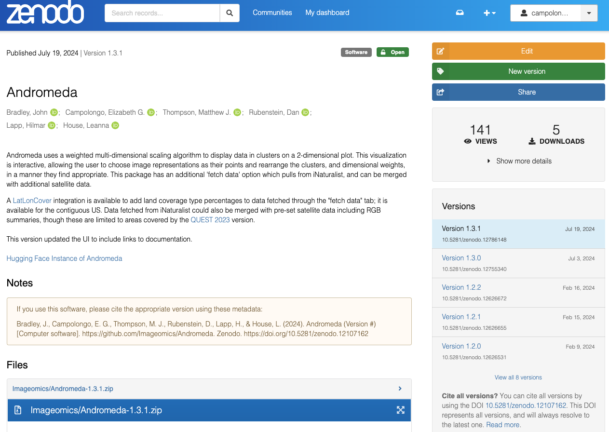

# DOI Generation

This guide discusses DOI generation for digital artifacts that may be associated with publications, such as datasets, models, and software.
You are likely familiar with DOIs from citing (journal/arXiv/conference) papers, as they are generated by the publisher in these instances and regularly used in citations. However, they are also invaluable for proper citation of code, models and data. One may think of this in the manner they are treated on arXiv, where there is the "cite as" or "for this version" (with the "v#" a the end) option when citing a preprint.

## What is a DOI?

A DOI (Digital Object Identifier) is a _persistent_ (permanent) digital identifier for any object (data, model, code, etc.) that _uniquely_ distinguishes it from other objects and links to information (or metadata) about the object. See the doi Foundation's [What is a DOI](https://www.doi.org/the-identifier/what-is-a-doi/) for more information.

## How do you generate a DOI?

When publishing code, data, or models, there are various options for DOI generation, and selecting one is generally dependent on where the object of interest is published. We will go over the two standard methods used by the Institute here, and mention a third option for completeness. A comparison of these three options is provided in the [Data Archive Options Comparative Overview](../pdfs/Data_Archive-Publication-Options-Comparative-Overview.pdf).

### 1. Generate a DOI on Hugging Face

This is the simplest method for generating a DOI for a model or dataset since [Hugging Face partnered with DataCite to offer this option](https://huggingface.co/blog/introducing-doi). 

!!! warning "Warning"
    Though it is a very simple process, it is not one to be taken lightly, as there is no removing data once this has been done--any changes require generation of a ***new*** DOI for the updated version: the old version will be maintained in perpetuity!

!!! warning "Warning"
    As stated in the [Imageomics Data Policy](../Data-Policy.md), DOIs are not to be generated for Imageomics Organization Repositories until approval has been granted by the Senior Data Scientist or Institute Leadership.

Hugging Face allows for the generation of a DOI through the settings tab on the Model or Dataset. For details on _how_ to generate a DOI with Hugging Face, please see the [Hugging Face DOI Documentation](https://huggingface.co/docs/hub/doi).

### 2. Generate a DOI with Zenodo

This is the most common method used for generating a DOI for a GitHub repository since [Zenodo](https://zenodo.org/) has a [GitHub integration](https://zenodo.org/account/settings/github/), which is accessed through your Zenodo account settings (for more information, please see GitHub's associated [Docs](https://docs.github.com/articles/referencing-and-citing-content)). Zenodo can also be used to generate DOIs for data, as is relatively common in biology. However, for direct-use of ML models and datasets, there are many more advantages to using Hugging Face; please see the [Data Archive Options Comparative Overview](../pdfs/Data_Archive-Publication-Options-Comparative-Overview.pdf) for more information.*

#### Automatic Generation

When your GitHub and Zenodo accounts are linked, there will be a list of available repositories under the GitHub tab in settings. All that are enabled are grouped at the top (just below the instructions). If a repository is enabled (the switch is on), then on your next GitHub release a DOI (or updated DOI) will be generated. Click on the DOI badge next to the repository to get the code to add the badge to your repository README. Clicking on the repository name will take you to information about that repository's releases.

{ loading=lazy, width="800" }

There is a "Sync now" button at the top right of the instructions, with information on when the last sync occurred. Observe that a badge appears for the enabled repository that <b>_has_</b> a DOI, while the one without just shows up as enabled; this will also be true for repositories to which you have access but that you did not submit to Zenodo yourself.

#### Metadata Tracking

When automatically generating a DOI with Zenodo, it uses information provided in your `CITATION.cff` file to populate the metadata for the record. However, there is important information that is not supported through this integration despite its inclusion in the `CITATION.cff` format in some cases. 

If your repository is likely to be updated repeatedly (i.e., generating new releases), then you may consider adding a `.zenodo.json` to preserve the remaining metadata on release sync with Zenodo for DOI. This metadata includes grant (funding) information, references (which may be included in your `CITATION.cff`), and a description of your repository/code.

A `.zenodo.json` can be created by applying [cffconvert](https://github.com/citation-file-format/cffconvert) to your `CITATION.cff` (without the references, as these are not supported). Then add the references and other metadata back in to the JSON (following the [Zenodo dev guide](https://developers.zenodo.org/#representation)). An example of this is the [Andromeda Zenodo JSON](https://github.com/Imageomics/Andromeda/blob/main/.zenodo.json), which was created in [this PR](https://github.com/Imageomics/Andromeda/pull/109).
The `publication_date` and `version` will need to be updated along with the `CITATION.cff` for each release.

_Alternatively_, this information can be updated manually on the Zenodo page for the DOI record. When logged in to Zenodo, a large orange "Edit" button will appear in the top right (as in the image below). There is the ability to save as you go (without publishing the metadata changes) and an additional option to share a link with collaborators to view the suggested record information.

{ loading=lazy, width="800" }
/// caption
///

!!! note "Note"
    Each collaborator who should have access to the Zenodo record must be manually granted access through their Zenodo account. This can be done by clicking on the "Share" button and selecting "Add people" at the pop-up screen.

    It is ***highly*** recommended that at least one other person on a project has access at the "manage" level.

#### Manual Generation

Building on the alternate edit options, there is also the option to simply generate one or all of your releases through a direct upload to Zenodo's site. Mixing the two methods is not advisable and may require reaching out to Zenodo to have them manually re-aligned to each other. Automatic generation through the GitHub integration is the recommended approach since it will generate an updated DOI on each release and create easier connections.

#### Access Management

When creating a new record on Zenodo, please ensure that other members of your project have access, as appropriate. In particular, there should be at least one member of Institute leadership or the Senior Data Scientist added to the record with management permissions. This ensures the ability to maintain the metadata and address matters related to the record (which may extend beyond your tenure with the Institute) in a timely manner.

### 3. Generate a DOI with Dryad

[Dryad](https://datadryad.org/stash/about) is another research data repository (similar to Zenodo) through which one can archive their research data and obtain a DOI. It has a review process when depositing data and requires dedication to the public domain (CC0) of all data uploaded. There are additional considerations factoring into our decision not to recommend Dryad for generating DOIs for Institute products. Please see the [Data Archive Options Comparative Overview](../pdfs/Data_Archive-Publication-Options-Comparative-Overview.pdf) for more information.*

 
 

*The [Data Archive Options Comparative Overview](../pdfs/Data_Archive-Publication-Options-Comparative-Overview.pdf) was created in May 2023 when we were deciding Institute archive recommendations, so it does not include information about newer features such as [Hugging Face's dataset viewer](https://huggingface.co/docs/hub/en/datasets-viewer), which greatly simplifies previewing datasets for downstream users.
